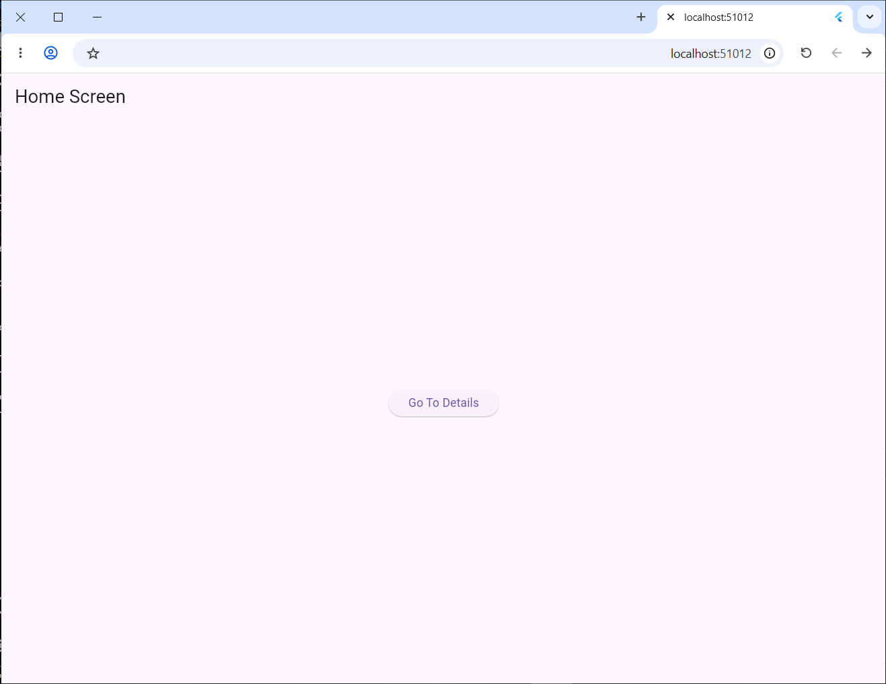
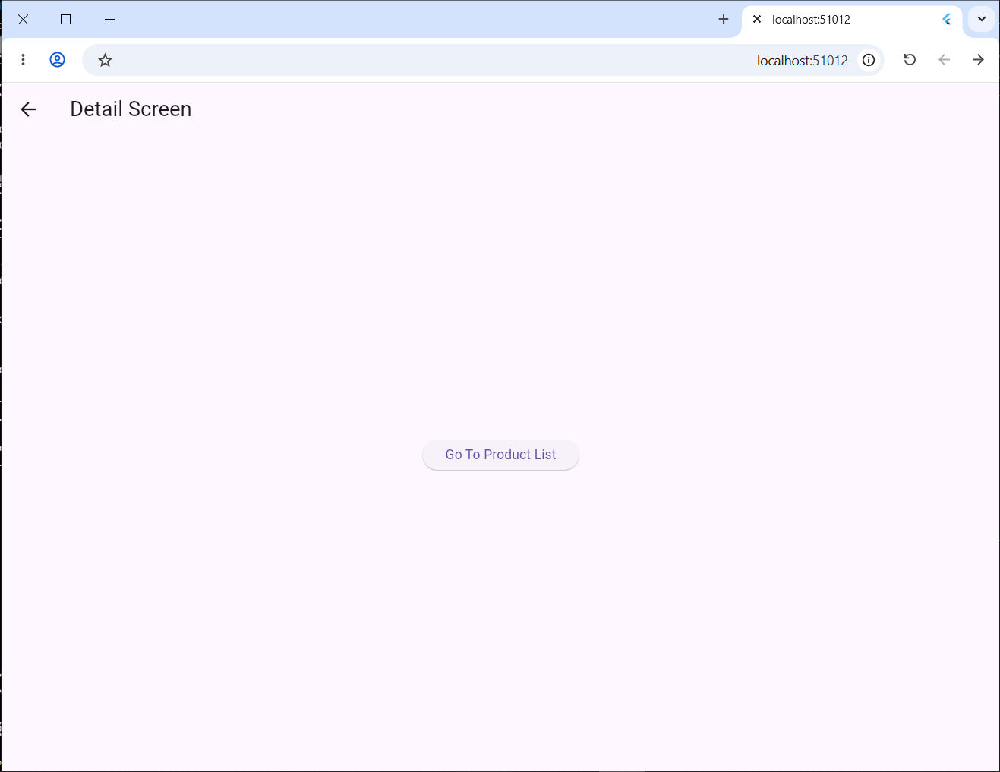
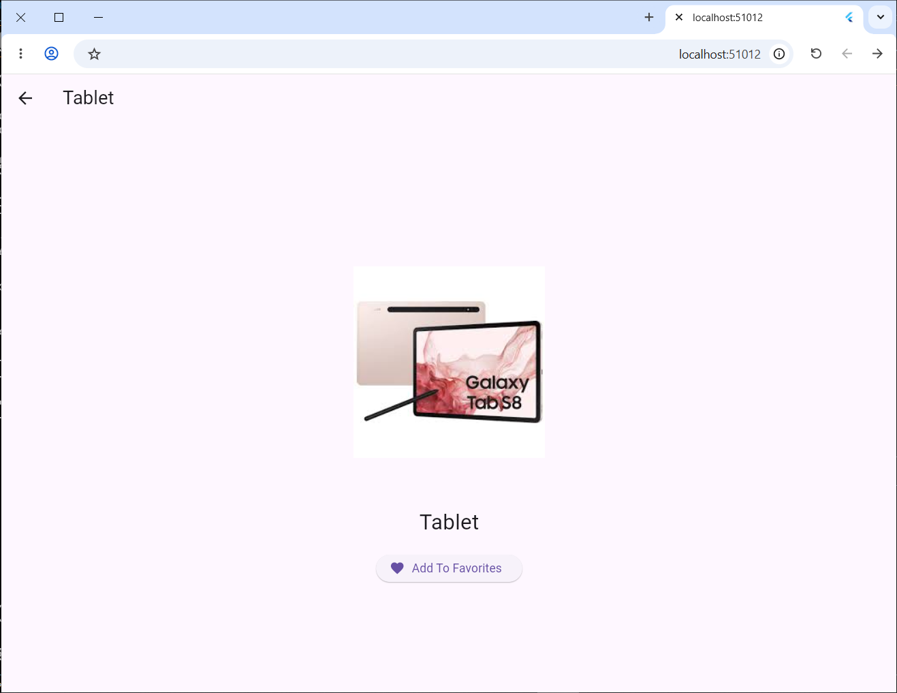
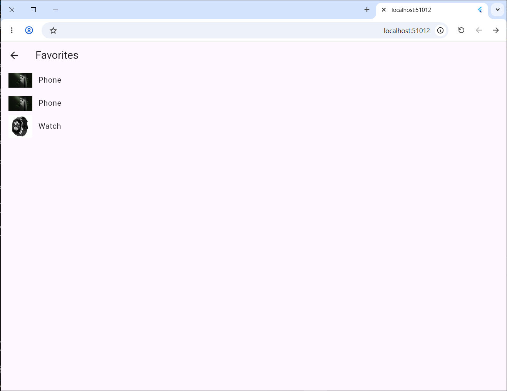

# flutter_application_1

التمرين الأول: Basic Stack Navigation

الخطوة 1: عند تشغيل التطبيق تظهر شاشة HomeScreen فقط داخل الـ Stack.

الخطوة 2: عند الضغط على زر الانتقال يتم استخدام Navigator.push() لإضافة شاشة DetailScreen فوق الشاشة الحالية.

الخطوة 3: يصبح الـ Stack يحتوي على شاشتين: HomeScreen ثم DetailScreen.

الخطوة 4: عند الضغط على زر الرجوع يتم استخدام Navigator.pop() لإزالة شاشة DetailScreen.

الخطوة 5: يعود التطبيق إلى شاشة HomeScreen فقط.

التمرين الثاني: Passing and Returning Data

الخطوة 1: عند تشغيل التطبيق تظهر شاشة ProductListScreen التي تحتوي على قائمة المنتجات.

الخطوة 2: عند اختيار منتج يتم استخدام Navigator.push() للانتقال إلى شاشة ProductDetailsScreen مع إرسال اسم المنتج.

الخطوة 3: يتم عرض تفاصيل المنتج في الشاشة الثانية.

الخطوة 4: عند الضغط على زر Add to Favorites يتم استخدام Navigator.pop() لإرجاع رسالة Added to favorites إلى الشاشة السابقة.

الخطوة 5: تظهر الرسالة في SnackBar داخل شاشة المنتجات.

الخطوة 6: يعود التطبيق إلى شاشة ProductListScreen بعد إزالة شاشة التفاصيل من الـ Stack.

